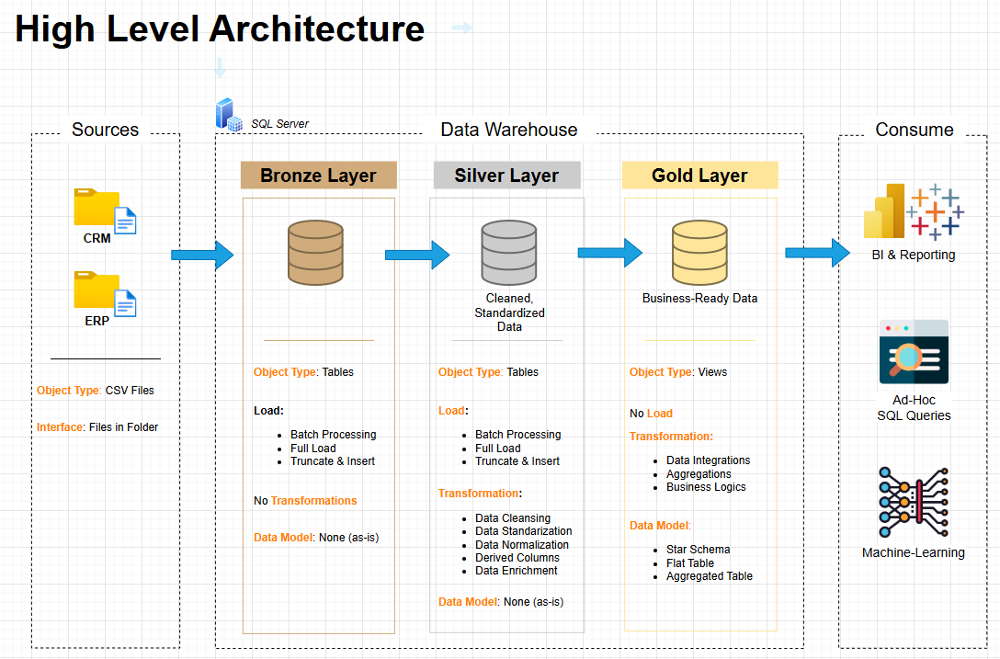

Retail Data Warehouse and Analytics Project

Welcome to the **Data Warehouse and Analytics Project** repository! 🚀  
This project demonstrates a comprehensive data warehousing and analytics solution, from building a data warehouse to generating actionable insights. Designed as a portfolio project, it highlights industry best practices in data engineering and analytics.

---
## 🏗️ Data Architecture

The data architecture for this project follows Medallion Architecture **Bronze**, **Silver**, and **Gold** layers:


1. **Bronze Layer**: Stores raw data as-is from the source systems. Data is ingested from CSV Files into SQL Server Database.
2. **Silver Layer**: This layer includes data cleansing, standardization, and normalization processes to prepare data for analysis.
3. **Gold Layer**: Houses business-ready data, structured around fact tables enriched with descriptive attributes for reporting and analytics.

---
## 📖 Project Overview

This project involves:

1. **Data Architecture**: Designing a Modern Data Warehouse Using Medallion Architecture **Bronze**, **Silver**, and **Gold** layers.
2. **ETL Pipelines**: Extracting, transforming, and loading data from source systems into the warehouse.
3. **Data Modeling**: Developing fact and dimension tables optimized for analytical queries.
4. **Analytics & Reporting**: Creating SQL-based reports and Power BI dashboards for actionable insights.

## 🚀 Project Requirements

### Building the Data Warehouse (Data Engineering)

#### Objective
Develop a SQL Server–based data warehouse to consolidate POS sales transactions, enabling store-hour analysis, product mix insights, and data-driven staffing decisions.

#### Specifications
- **Data Sources**: Import sales exports from the POS system provided as monthly CSV files.
- **Data Quality**: Clean and standardize product names, categorize items consistently, and detect/refine refund transactions before reporting.
- **Integration**: Combine all exports into a unified fact-centric model, enriched with time and store-hour attributes to support analytical queries.
- **Scope**: Focus on transactions from Jan 2025 onwards; no historization of prior years is required.
- **Documentation**: Provide clear SQL scripts, schema definitions, and data enrichment to support both business stakeholders and analytics users.

---

### BI: Analytics & Reporting (Exploratory Analysis)

#### Objective
Develop SQL-based exploratory analysis on curated sales data (before enrichment) to uncover patterns in:
- **Transaction Volumes** (by day, time, and weekday)
- **Preliminary Sales Trends** (monthly and weekly variations)
- **Refund Detection** (customer change-of-mind events)

These exploratory insights provided stakeholders with an early understanding of sales dynamics and data quality, forming the basis for informed decision-making.  

## 📂 Repository Structure
```
PigmentSquad-DWH-SQL/
│
├── datasets/                           # Raw datasets used for the project (POS data)
│
├── docs/                               # Project documentation and architecture details
│   ├── data_architecture.png           # Shows the project's architecture
│   ├── data_catalog.md                 # Catalogue of datasets, including field descriptions and metadata
│   ├── data_flow.png                   # Shows the data flow diagram
│   ├── data_models.png                 # Shows the data models (fact table only)
│
├── scripts/                            # SQL scripts for ETL and transformations
│   ├── bronze/                         # Scripts for extracting and loading raw data
│   ├── silver/                         # Scripts for cleaning and transforming data
│   ├── gold/                           # Scripts for creating analytical models
│
├── tests/                              # Test scripts and quality files
│
├── README.md                           # Project overview and instructions
├── LICENSE                             # License information for the repository
├── .gitignore                          # Files and directories to be ignored by Git
└── requirements.txt                    # Dependencies and requirements for the project
```
---
